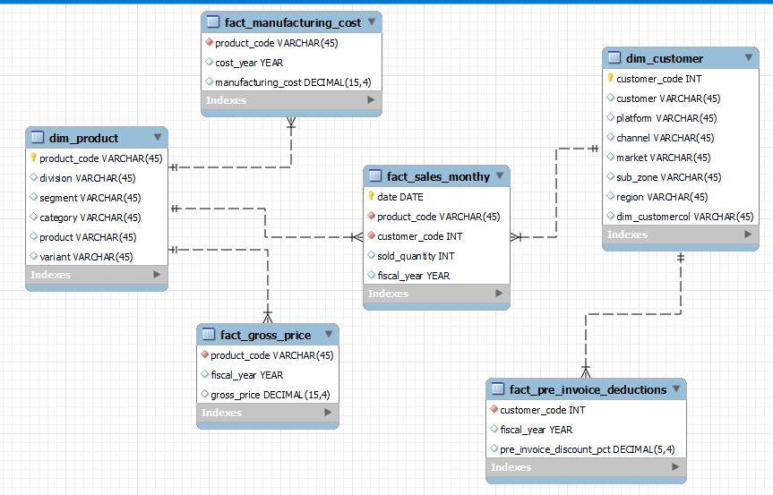
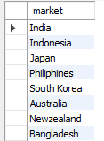
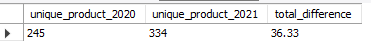
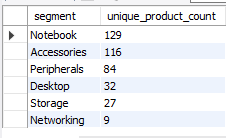
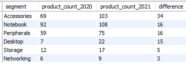
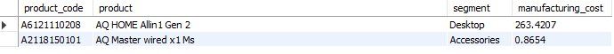
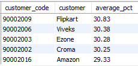
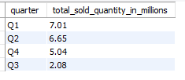
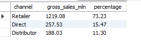
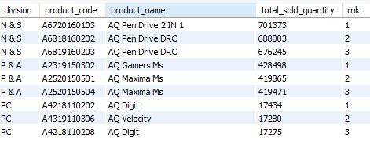

# Atliq_sql_project

# Goal 
The goal of this project is to provide clear and accurate insights for 10 specific business questions from the ad hoc requests. these insights will be used by executive as top management to 
improve decision - making.

# Role 
My role is to act as a data analyst who is responsible for analyzing business data using SQL and presenting actionable insights 

# Task 
- Run SQL queries to answer the ad hoc business requests
- Analyze the data and identify key insights that respond to the needs of the business

# Data Source:
A sql files is provided by codebasics, which i have imported into Mysql Workbech and have got access the database named gbd0041(atliq_db). It include six main table 
1. **dim_customer**                - contain customer-related data
2. **dim_product**                 - contain product-related data
3. **fact_gross_price**            - contain gross price information for each product
4. **fact_manufacturing_cost**     - contain the cost incurred in the prodcution of each product
5. **fact_pre_invoice_deductions** - contain pre invoice deductions information for each product
6. **fact_sales_monthly**          - contains monthly sales data for each product

# Data modelling
Here you can check the Data Model which is uded for this project. I have created this model in MySQL workbench

# Business Questinos (ad - hoc - request) 
There are 9 ad hoc question on which i can run  SQL queries to extract answer and then analyze it for getting key insights from the outputs. 
you can see the ad - hoc - request [here](ad_hoc_request)

check out the Quries from [here](sql_queries/atliq_ad_hoc_queries.sql)

# Queries Insights 

1. Provide the list of markets in which customer "Atlique Exclusive" operates its business in the APAC region
   
 
      
   

   These are the list of market that atliq handling the business in APAC region 

2. what is the percentage of unique product increase in 2021 vs 2020 ?
      
 
     
      

- A **36.33%** increase in unique products reflects a significant product expansion strategy.
- Growing product diversity may cater to evolving consumer demands, potentially enhancing market share.

3. Provide a report with all the unique product count for each segment and sort them in desceding order of product counts.
- These are the list of unique products and its count 
     
 
     
      

      
4. Follow up which segment had the most increase in unique products in 2021 vs 2020
   
 
     
      

- **Accessories** had the largest product increase, suggesting strong customer interest. Prioritize this segment for increased marketing and product development to maximize revenue.
- Minimal growth in **Storage and Networking** may indicate limited demand. Assess these segments for possible optimization or cost reduction.

5. Get the products that have the highest and lowest manufacturing costs
   
 
     
      

-  Consider evaluating high-cost products like AQ HOME Allin1 Gen 2 for possible cost-saving measures in manufacturing.
6. Generate a report that contains the top 5 customers who received an average high_pre_invoice_discount_pct for the fiscal_year 2021 and in the indian_market.
   
 
     
      

-  Top customers like Flipkart, Viveks, and Ezone received **average discounts above 30%**. This strategy may be beneficial for volume sales but should be balanced against profit margins.Evaluate if these discounts are driving enough revenue to justify the lower margins.
  
7. In which quater of 2020 got the maximum total_sold_quantity?
   
 
     
      

- The **Q1** achieved the highest total sold quantity at **7.01 million units**, indicating strong sales performance at the beginning of the year.
- Sales decreased in **Q2, Q4, and dropped significantly in Q3,** suggesting potential challenges like COVID-19 Pandemic Impact, economic uncertainty, Market Saturation, Retail and Distribution Challenges affecting sales as the year progressed.
  
8. which channel bring more gross sales in the fiscal year 2021 and the percentage of contribution
   
 
     
      

- The retailer channel generated $1,219.08 million, contributing 73.23% of total gross sales, highlighting its crucial role in revenue generation.
- Strengthen relationships with retailers for better promotions while exploring ways to enhance sales through direct and distributor channels to improve overall contributions.
  
9. Get the top 3 products in each division that have a high_total_sold_quantity in the year fiscal_year 2021 ?
    
 
     
      

- The top-selling products are pen drives and gaming mice, indicating a high consumer preference in these categories. This suggests opportunities to expand product offerings and marketing efforts in these areas.
-  The PC division's highest-selling product had significantly lower sales compared to other divisions, highlighting potential issues such as limited product variety or lack of market awareness. Further analysis is needed to improve performance.
-  Ensure sufficient stock for high-demand products and consider targeted marketing strategies for the PC division to boost sales and align with consumer trends.

10. Get the report of the gross sales amount for the customer "Atliq Exclusive" for each month in fiscal_year = 2021. This analysis to get an idea of low and high performing months and take strategic decisions,the Final output inclued contains these columns  month, year, gross sales amount
    
